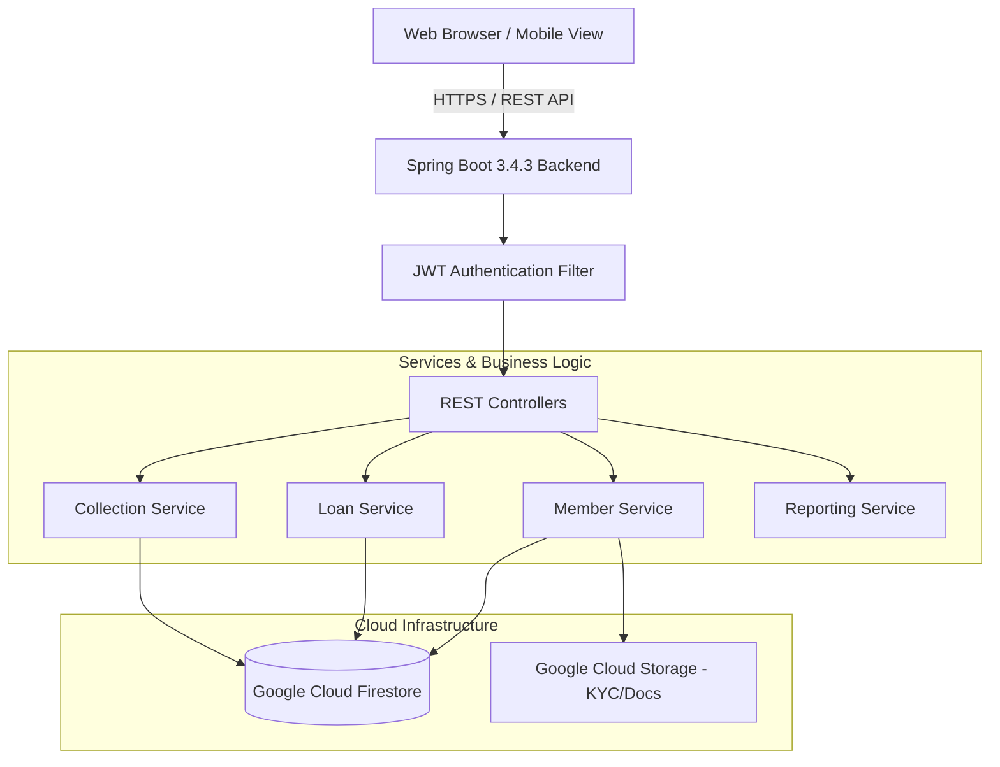

# 💰 Bachat Gat / Self-Help Group (SHG) Management Platform
> **Grow UR Money** — Cloud-ready financial management and governance platform for Self-Help Groups (Bachat Gat / SHGs), featuring role-based authentication, group-scoped ledgers, loan lifecycle tracking, monthly Bachat collections, reports, mobile-friendly screens, and multilingual localization.

[](https://openjdk.org/)
[](https://spring.io/projects/spring-boot)
[](https://cloud.google.com/)
[](https://jwt.io/)
[](#multilingual-support)

---

## 📌 Table of Contents
- [Overview](#overview)
- [Key Features](#key-features)
- [Technology Stack](#technology-stack)
- [System Architecture](#system-architecture)
- [Project Directory Structure](#project-directory-structure)
- [Prerequisites](#prerequisites)
- [Getting Started & Local Setup](#getting-started--local-setup)
- [Configuration & Environment Variables](#configuration--environment-variables)
- [API Endpoints Overview](#api-endpoints-overview)
  - [Multilingual Support](#multilingual-support)
  - [Security and Cost Controls](#security-and-cost-controls)
- [Contributing](#contributing)
- [License](#license)

---

## 🌟 Overview

The **Bachat Gat SHG Management Platform** digitizes the operations of micro-savings communities, Self-Help Groups (SHGs), and Bachat Gats. Traditional groups rely heavily on physical registers, manual passbooks, and cash handoffs which are prone to errors and lack transparency.

This platform provides:
- **Transparent Ledger Accounting**: Real-time tracking of monthly compulsory savings, penalties, and late fees.
- **Complete Loan Lifecycle**: Application, committee review, disbursement, interest calculation, and installment repayment tracking.
- **Bilingual Interface**: Full support for **English** and **Marathi (मराठी)** to ensure grassroots accessibility for all members and officers.
- **Enterprise-grade Cloud Storage & Database**: Backed by Google Cloud Firestore for transactional consistency and Google Cloud Storage for member KYC and loan documents.

---

## ✨ Key Features

### 1. 👥 Member & Identity Management
- **Role-Based Access Control**: Separate workflows for `Super Admin`, `Group Admin / President / Secretary`, and `General Member`.
- **Dual-Role Login Detection**: Seamlessly switches context for users who are both an administrator and an individual group member.
- **First-time Onboarding & Password Setup**: Secure self-service initial password / PIN creation for newly enrolled members.
- **KYC & Documentation**: Upload and manage identity verification documents via secure GCP Cloud Storage buckets.

### 2. 💵 Monthly Savings & Collections
- **Batch Collection Tracking**: Record monthly contributions with instant receipt generation.
- **Fines & Penalties**: Automatic calculation of late attendance or missed contribution penalties.
- **Member Passbooks**: Digital, real-time passbook reflecting all lifetime deposits, interest gains, and active balances.

### 3. 📑 Loan Management Lifecycle
- **Loan Applications**: Members can apply for loans online with custom repayment terms and purpose declarations.
- **Approval Workflow**: Multi-tier committee verification and approval by group leaders.
- **Repayment & EMI Schedules**: Dynamic EMI tracking with interest breakdown and outstanding principal tracking.

### 4. 🏛️ Meetings & Group Governance
- **Meeting Logs**: Record minutes of meeting, resolutions, and decision summaries.
- **Attendance Registry**: Monitor member participation in periodic meetings.

### 5. 📊 Finance, Incomes & Expenses
- **Cash Flow Records**: Monitor bank balance, petty cash, external grants, and administrative expenses.
- **Audit Trails**: Full system audit logging for compliance and transparency.

### 6. 🌐 Multilingual Support (i18n)
- Seamless switching between **English**, **मराठी (Marathi)**, and **हिन्दी (Hindi)** across supported dashboards, forms, tables, reports, collections, and account settings.

### 7. 📊 Reports and Member Transparency
- Month-specific group financial reports with collection, pending, penalty, fund, loan, income, and expense totals.
- Admin report tabs for summaries, monthly collections, yearly statements, outstanding loans, and member statements.
- Member-scoped reports that derive the group from the authenticated account and never accept a client-selected group.
- Print / Save as PDF and CSV download options for report output.
- Member collection and transaction views, including compatibility display for legacy collection records.

### 8. 📱 Responsive and Account Features
- Responsive layouts for dashboards, tables, collections, reports, forms, and payment modals.
- Group-scoped member registration IDs and 20-member pagination.
- Self-service username and password changes with server-side validation and BCrypt password hashing.

---

## 🛠 Technology Stack

### Backend
- **Language**: Java 21 (LTS)
- **Framework**: Spring Boot 3.4.3
- **Security**: Spring Security 6 with JJWT (0.12.6) token authentication & BCrypt password hashing
- **Data & Cloud**:
  - Google Cloud Firestore (Official SDK `com.google.cloud:google-cloud-firestore`)
  - Google Cloud Storage (`com.google.cloud:google-cloud-storage`)
- **Observability**: Spring Boot Actuator & Cloud-ready JSON console logging

### Frontend
- **Structure**: Semantic HTML5
- **Styling**: Vanilla CSS Design System with responsive mobile-first layouts, modern card components, and dark/light accents
- **Logic**: Vanilla JavaScript (ES6+ Fetch API, async/await, client-side session management)
- **Localization**: Custom client-side i18n dictionary system supporting English & Marathi

---

## 🏗 System Architecture



---

## 📁 Project Directory Structure

```text
Grow_UR_Money/
├── pom.xml                                 # Maven dependencies & build configuration
├── src/
│   ├── main/
│   │   ├── java/com/bachatgat/
│   │   │   ├── BachatGatApplication.java   # Spring Boot Application Entry Point
│   │   │   ├── config/                     # Security, WebMVC, and GCP Bean Configurations
│   │   │   ├── controller/                 # REST APIs (Auth, Admin, Member, Reports, etc.)
│   │   │   ├── dto/                        # Data Transfer Objects & Request/Response models
│   │   │   ├── exception/                  # Global Exception Handling & Error responses
│   │   │   ├── model/                      # Domain entities (Member, Loan, Collection, etc.)
│   │   │   ├── repository/                 # Firestore Data Access Layer
│   │   │   ├── scheduler/                  # Scheduled background tasks
│   │   │   ├── security/                   # JWT filters, UserDetailsService, Auth tokens
│   │   │   ├── service/                    # Business logic implementations
│   │   │   └── util/                       # Helper utilities & constants
│   │   └── resources/
│   │       ├── application.properties      # Default configuration & environment placeholders
│   │       └── static/                     # Frontend web application
│   │           ├── admin/                  # Admin portal (dashboard, loans, members, meetings)
│   │           ├── user/                   # Member portal (dashboard, passbook, applications)
│   │           ├── css/                    # Global & page-specific stylesheets
│   │           ├── js/                     # API client, session management, UI utilities
│   │           ├── i18n/                   # Language translation files (en.json, mr.json)
│   │           ├── login.html              # Unified login interface
│   │           ├── first-login.html        # Initial password setup for new members
│   │           └── index.html              # Landing page
└── README.md
```

---

## 📋 Prerequisites

Before running the application locally, ensure you have:
1. **JDK 21** installed (`java -version`).
2. **Apache Maven 3.9+** installed (`mvn -version`).
3. **Google Cloud Credentials**:
   - Access to a Google Cloud Project with **Firestore** and **Cloud Storage** enabled.
   - Or the [Google Cloud Firestore Emulator](https://cloud.google.com/firestore/docs/emulator) for offline development.

---

## 🚀 Getting Started & Local Setup

### 1. Clone the Repository
```bash
git clone https://github.com/Harriom1/Bachat_Gat.git
cd Bachat_Gat
```

### 2. Configure Google Cloud Credentials
Set up Application Default Credentials (ADC) on your machine:
```bash
gcloud auth application-default login
```
Or export the path to your service account JSON file:
```bash
# On Windows (PowerShell)
$env:GOOGLE_APPLICATION_CREDENTIALS="C:\path\to\service-account-key.json"

# On Linux / macOS
export GOOGLE_APPLICATION_CREDENTIALS="/path/to/service-account-key.json"
```

### 3. Build the Project
Compile and package the application with Maven:
```bash
mvn clean install
```

### 4. Run the Application
Start the Spring Boot server:
```bash
mvn spring-boot:run
```

The application will launch on `http://localhost:8080`.

---

## 🔐 Security and Cost Controls

- Authentication uses JWT tokens and BCrypt-hashed passwords; passwords are not stored in plain text.
- Member APIs derive `memberId` and `groupId` from the authenticated principal for group isolation.
- Payment orders are server-validated and use idempotent verification to reduce duplicate ledger entries.
- Keep `JWT_SECRET` and service-account credentials in Secret Manager or local environment variables. Never commit key files.
- Cloud Build deploys to Cloud Run with `--min-instances=0`, a small memory/CPU profile, and bounded concurrency to reduce idle billing.
- The application uses its existing static translation dictionaries rather than a paid translation API, avoiding per-request translation charges.
- Firestore and Cloud Storage remain the only application data services; no additional paid service is required for local development.

## ⚙️ Configuration & Environment Variables

Key properties can be customized via environment variables:

| Environment Variable | Description | Default Value |
|----------------------|-------------|---------------|
| `PORT` | HTTP Server Port | `8080` |
| `SPRING_PROFILES_ACTIVE` | Active Spring Profile (`dev` / `prod`) | `dev` |
| `GCP_PROJECT_ID` | Google Cloud Project ID | *(set in deployment environment)* |
| `FIRESTORE_DATABASE` | Firestore Database ID | `(default)` |
| `FIRESTORE_EMULATOR_ENABLED` | Set `true` to use local Firestore emulator | `false` |
| `STORAGE_BUCKET` | Cloud Storage bucket for uploads | `midc-doc-uploader-revamp-bachatgat-docs` |
| `JWT_SECRET` | Secret key used for signing JWT tokens | *(required; use Secret Manager in production)* |
| `JWT_EXPIRATION_MS` | JWT token expiration in milliseconds | `86400000` (24 hours) |

---

## 📡 API Endpoints Overview

| Area | Method | Endpoint | Description | Access |
|------|--------|----------|-------------|--------|
| **Auth** | `POST` | `/api/auth/login` | Authenticate user & issue JWT | Public |
| **Auth** | `POST` | `/api/auth/first-time-setup` | Set password for new members | Public |
| **User** | `GET` | `/api/user/profile` | Fetch logged-in user profile | Member/Admin |
| **User** | `GET` | `/api/user/passbook` | Member personal passbook & history | Member |
| **Admin** | `GET` | `/api/admin/members` | List group members | Admin |
| **Admin** | `POST` | `/api/admin/members` | Enroll new member | Admin |
| **Admin** | `GET` | `/api/admin/collections` | Fetch monthly savings collections | Admin |
| **Admin** | `POST` | `/api/admin/collections` | Record new savings deposit | Admin |
| **Admin** | `GET` | `/api/admin/loans` | Review loan applications | Admin |
| **Admin** | `POST` | `/api/admin/loans/{id}/approve` | Approve loan disbursement | Admin |
| **Admin** | `GET` | `/api/admin/reports/summary` | Group financial summary report | Admin |
| **Member** | `GET` | `/api/me/report/monthly?month={month}&year={year}` | Authenticated member's own group monthly report | Member |
| **Account** | `POST` | `/api/auth/change-username` | Change the authenticated user's own username | Authenticated |
| **Account** | `POST` | `/api/auth/change-password` | Change password after current-password validation | Authenticated |
| **Health** | `GET` | `/actuator/health` | Spring Boot Actuator health check | Public |

---

## 👥 Authors & Acknowledgments

- **Lead Developer**: Harriom ([@Harriom1](https://github.com/Harriom1))
- Built with ❤️ for community empowerment and transparent Self-Help Group financial governance.
